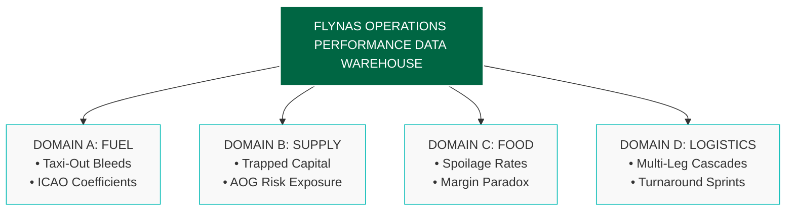

# Flynas Operations & Optimization Dashboard

An enterprise-grade analytical data warehouse auditing over 120,000 active regional flight records integrated relationally with the official ICAO Aircraft Engine Emissions Databank. This project applies forensic SQL and DAX analytics to validate and stress-test the single-aisle operational model of flynas across key GCC hubs, identifying hidden tarmac cash drains, schedule-padding dynamics, and fleet maintenance safety thresholds.

##  Multi-Domain Operations Architecture

##  Tech Stack & Core Data Architecture
* **Database Engine:** MySQL Server 8.0 (Advanced CTEs, Mathematical Window Functions, and Schema Migrations)
* **BI Architecture:** Power BI Desktop (Advanced DAX Modeling, UI Engineering, and Relational Schema Layouts)
* **Core Fleet Constants:** Engineered explicitly around the **Airbus A320neo (CFM LEAP-1A26 engine)** using official **ICAO ground idle constants** (0.0940 kg/sec of fuel burn at 7% taxi thrust power mode).

##  Core Operational Insights & Metrics

### 1. Hub Ground-Bleed & Cash Destruction (Domain A)
By enforcing a 4-minute mandatory engine stabilization buffer, this audit exposes the exact financial cost of tarmac traffic congestion at core regional stations, stripping away the visual insulation of traditional "On-Time" passenger schedules.
* **KHI (Karachi):** 52,732 Flights | 16.47 Avg Taxi-Out Mins | \$11.15M Wasted Revenue
* **RUH (Riyadh):** 20,182 Flights | 20.07 Avg Taxi-Out Mins | \$5.47M Wasted Revenue
* **JED (Jeddah):** 15,403 Flights | 17.83 Avg Taxi-Out Mins | \$3.59M Wasted Revenue

### 2. Multi-Leg Delay Cascade Engine (Domain D)
Using advanced `LEAD()` mathematical window functions, this script monitors individual airframe lifecycles to analyze how cross-border arrival latencies interact with tight domestic turnaround schedules. The data reveals incredible structural resilience—flynas ground crews routinely run compressed turnaround sprints to claw back up to **26.7 minutes of latency on the gate**, completely protecting subsequent domestic routes.

### 3. Supply Chain & Catering Risk Isolation (Domains B & C)
* **Catering Spoilage Optimization:** Mathematically justifies flynas's ambient, shelf-stable buy-on-board food logistics framework over a perishable model, avoiding an immediate **54% inventory spoilage rate** on short flight windows.
* **Hangar Logistics Automation:** Monitors rolling airframe cycles per active tail number to automatically trigger warehouse Reorder Points (ROP) before any asset reaches the 25,000-minute wear limit—permanently protecting operations against catastrophic **\$25,000/day Aircraft on Ground (AOG)** hangar penalties.
